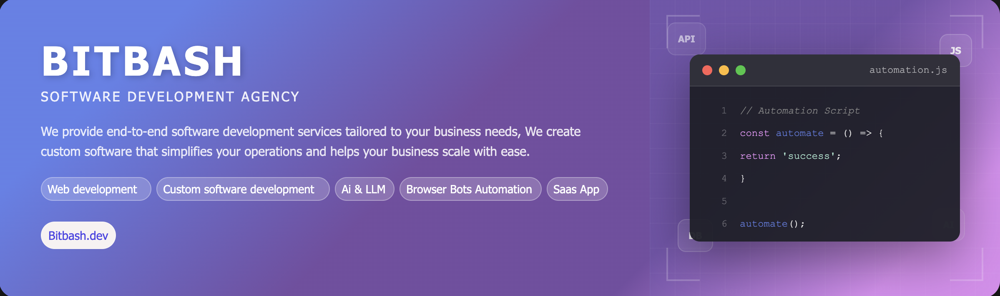

# Custom Power Automate Desktop Workflow Automation

  

  &nbsp;
  &nbsp;
  &nbsp;
  

  <strong>Looking for custom software solution services? Let’s talk.👆👆</strong>

A modular, desktop-level automation framework built with Microsoft Power Automate Desktop (PAD) to eliminate repetitive Windows tasks. It focuses on configurable workflows, robust error handling, and seamless integrations (files, Excel/CSV, APIs, email).

## Introduction
> This project provides a scalable PAD framework to automate routine Windows operations—file handling, UI interactions, data transfers, Excel/CSV processing, and system integrations. It’s designed for teams who need maintainable, configurable, and deployable desktop automations without rewriting flows for every use case.

### Key Benefits
- Faster delivery with reusable, modular actions  
- Safer runs via built-in logging and retries  
- Easier ops through config-driven orchestration and simple UI  

## Features
| Feature | Description |
|---------|-------------|
| Modular Action Library | File, Excel/CSV, UI, HTTP, and email actions packaged as reusable PAD subflows. |
| Orchestration & Triggers | Schedule, file-watcher, and manual run modes with branching and dependency control. |
| Config-Driven Setup | JSON/YAML config for paths, credentials, schedules, and feature toggles; optional lightweight UI. |
| Logging & Error Handling | Centralized logs, retries, notifications, and error wrapping for reliable operations. |

## Use Cases
- Automated file pipeline (ingest → validate → move/rename → archive)  
- Excel/CSV ETL: read, transform, and export reports nightly  
- API synchronization: pull JSON, enrich locally, send updates via HTTP  
- Email operations: parse inbox, extract attachments, trigger downstream flows  

## FAQs
Q: Can I run multiple workflows with different settings?  
A: Yes. The orchestration flow reads per-workflow JSON/YAML configs, enabling separate schedules, inputs, and modules.

Q: How are failures handled during execution?  
A: Each action is wrapped with retry and error capture; failures are logged with context and can trigger notifications.

Q: Do I need code to extend features?  
A: No for most cases—use PAD actions and configs. For advanced tasks, you can plug in PowerShell/Python scripts as modules.

Q: What integrations are supported out of the box?  
A: File system, Excel/CSV, HTTP APIs (JSON), and email (SMTP/IMAP). Additional connectors can be added as modules.

Q: How is the solution deployed to user machines?  
A: We provide a PAD package, folder structure, and install guide. Drop in configs and import flows to start.

Q: How do I monitor what happened during a run?  
A: Use the logging module and optional log viewer/dashboard to see run status, timings, and error details.

## Contact Us
Looking for custom software solution services? Let’s talk.  

  &nbsp;
  &nbsp;
  &nbsp;
  

